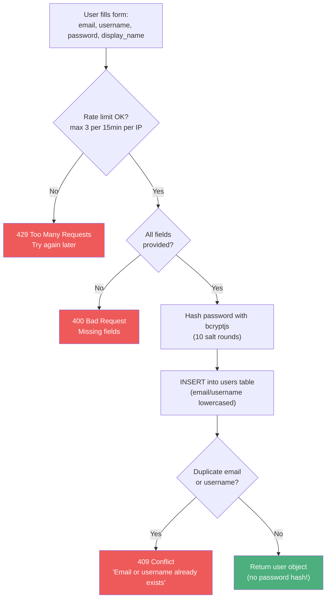
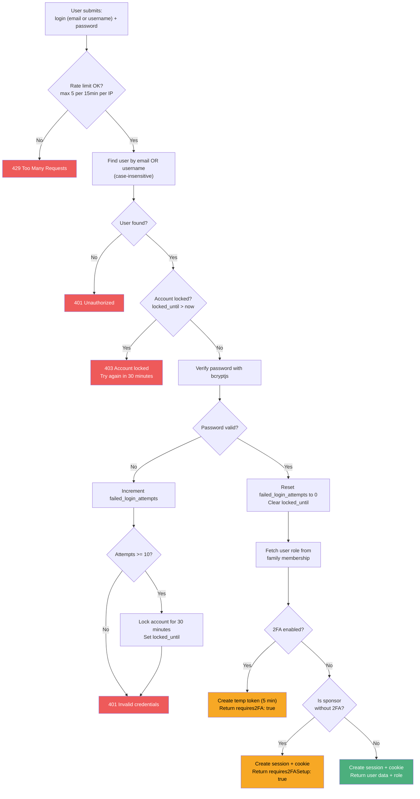

# Registration & Login

## Registration

## Login

## Security measures

| Protection | Details |
|-----------|---------|
| **Rate limiting** | Register: 3/15min, Login: 5/15min (per IP) |
| **Password hashing** | bcryptjs with 10 salt rounds |
| **Account lockout** | 10 failed attempts = 30-minute lock |
| **Session** | JWT in httpOnly cookie, 7-day expiry, SameSite=lax |

## Related flows

- [Two-Factor Auth](./two-factor-auth.md) - what happens when 2FA is enabled
- [Family Management](./family-management.md) - role is determined by family membership
