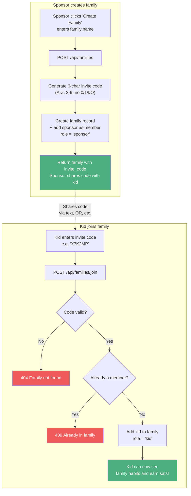
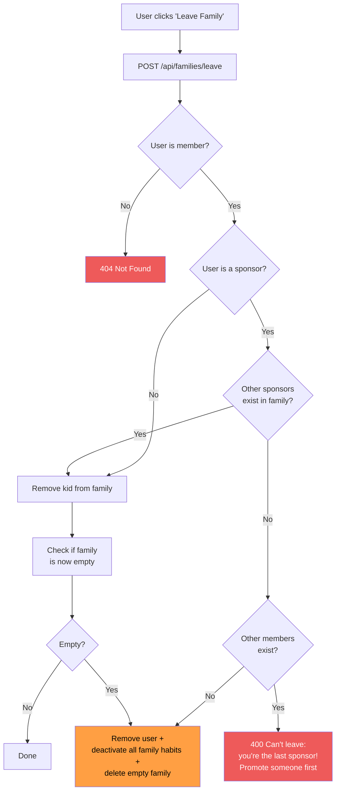
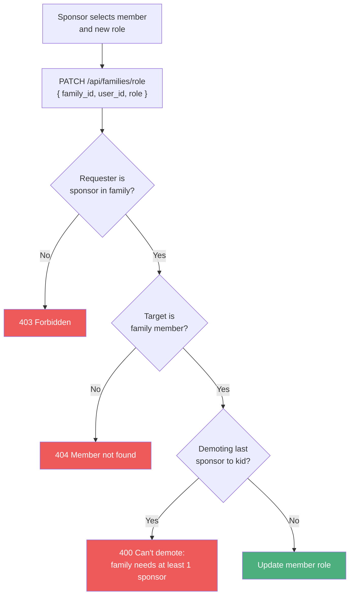

# Family Management

## Creating a Family & Joining

## Leaving a Family

## Changing Roles

## Invite code design

- 6 characters: uppercase letters + digits
- Excludes confusing characters: `0`, `1`, `I`, `O` (avoids 0/O and 1/I/l confusion)
- Alphabet: `ABCDEFGHJKLMNPQRSTUVWXYZ23456789` (32 chars = ~1 billion combinations)

## Related flows

- [Registration & Login](./auth.md) - role is determined by family membership
- [Habit Lifecycle](./habit-lifecycle.md) - habits are scoped to families
