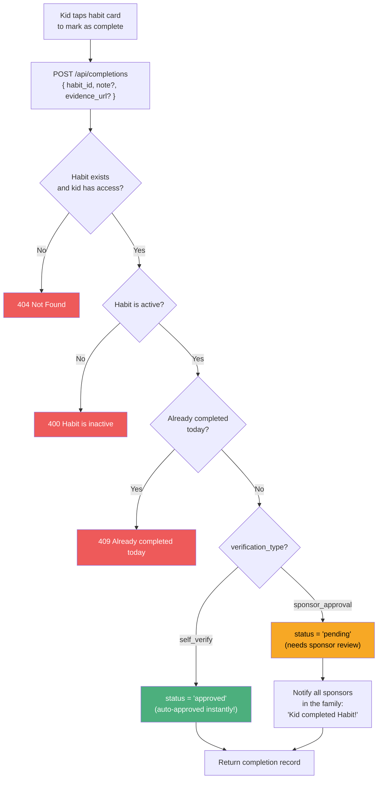

# Habit Completion by Kid

## Completion Flow

## One completion per day

The database enforces a unique constraint on `(habit_id, user_id, date)`. A kid can only complete each habit once per day, regardless of schedule type.

## What happens next?

- **If self-verified**: Completion is done. If the habit has a sat reward and the kid is in a family, payment would need to be triggered separately
- **If sponsor approval**: All sponsors in the family get a notification. The sponsor can then approve or reject from their dashboard

## Related flows

- [Payment Cascade](./payment-cascade.md) - what happens when a sponsor approves
- [Notifications](./notifications.md) - how sponsors get notified
- [Habit Lifecycle](./habit-lifecycle.md) - habit schedule and verification types
