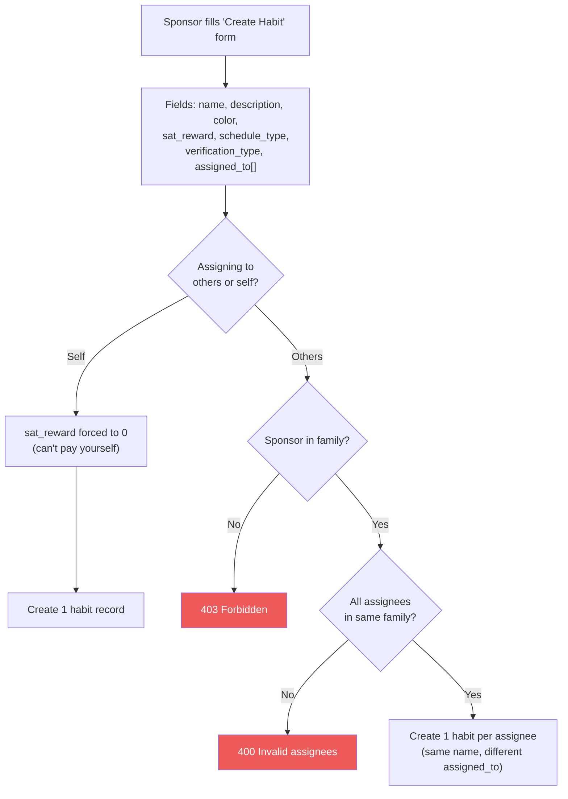

# Habit Lifecycle

## Creating a Habit

## Schedule Types

| Type | Example | DB fields |
|------|---------|-----------|
| `daily` | Every day | Just `schedule_type` |
| `specific_days` | Mon/Wed/Fri | `schedule_days: [1, 3, 5]` (0=Sun, 6=Sat) |
| `times_per_week` | 3 times per week | `schedule_times_per_week: 3` |

## Verification Types

| Type | Flow | Use case |
|------|------|----------|
| `sponsor_approval` | Kid completes, sponsor must approve before payment | Tasks that need verification (e.g., "clean room") |
| `self_verify` | Kid completes, auto-approved instantly | Trust-based tasks (e.g., "read for 20 minutes") |

## Updating & Deleting

- **Update**: Only the creator can update. Can change name, color, reward, schedule, and reassign to different family members
- **Delete**: Soft delete only (sets `active = false`). Preserves completion history

## Related flows

- [Habit Completion](./habit-completion.md) - how kids complete habits
- [Family Management](./family-management.md) - habits are scoped to families
- [Payment Cascade](./payment-cascade.md) - what happens after approval
