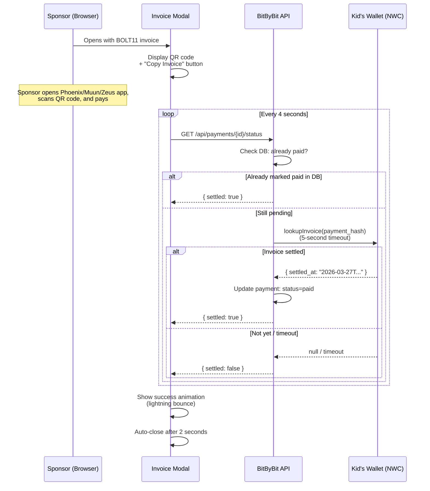

# Invoice Modal (QR Polling)

When WebLN and NWC auto-pay both fail, the sponsor sees a QR code modal as a last resort.

## Polling Flow

## How it works

1. Modal displays the BOLT11 invoice as a QR code
2. Sponsor scans with any Lightning wallet app (Phoenix, Muun, Zeus, etc.)
3. Modal polls the server every 4 seconds asking "was it paid?"
4. Server checks the kid's wallet via NWC `lookupInvoice()`
5. When settled, the modal shows a celebration animation and auto-closes

## Why poll the kid's wallet?

The invoice was created by the kid's wallet, so only the kid's wallet knows when it was paid. The server asks the kid's wallet "did you receive that payment?" using the `payment_hash` as the lookup key.

## Related flows

- [Payment Cascade](./payment-cascade.md) - the full 3-tier flow that leads here
- [Payment Retry](./payment-retry.md) - what happens if the invoice expires
