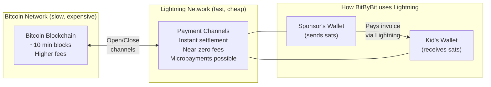
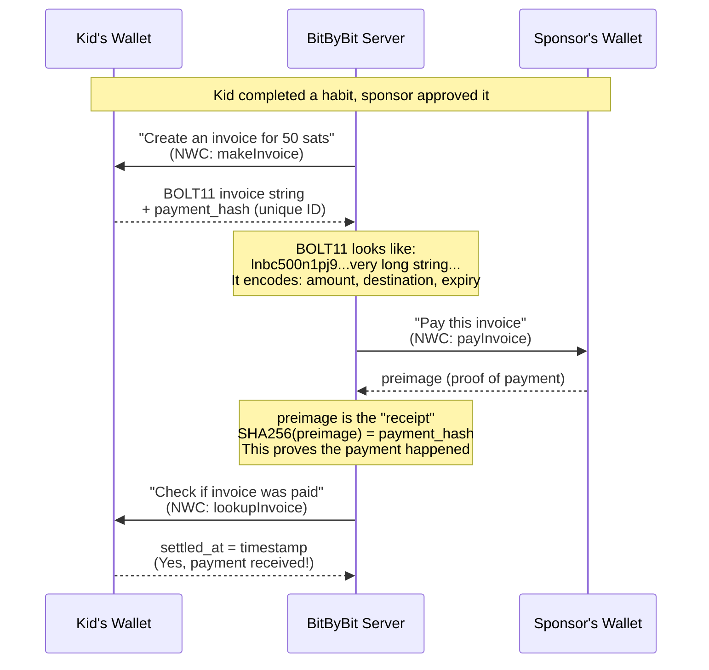
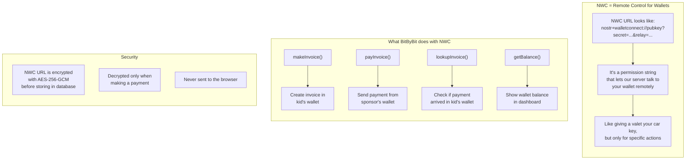

# Lightning Network Basics

If you're new to Lightning, here's how the pieces fit together in BitByBit.

## Key Concepts

## What is an Invoice? (BOLT11)

A Lightning invoice is like a payment request. The kid's wallet creates it, and the sponsor's wallet pays it.

## Key terms

| Term | What it is | Analogy |
|------|-----------|---------|
| **BOLT11** | Invoice format string (starts with `lnbc...`) | A bill/check at a restaurant |
| **payment_hash** | Unique ID for the invoice (SHA256 hash) | The invoice number |
| **preimage** | Secret revealed when paid; SHA256(preimage) = payment_hash | The receipt/proof of payment |
| **sats** | Smallest Bitcoin unit (1 BTC = 100,000,000 sats) | Cents to dollars |
| **millisats** | 1/1000 of a sat (used internally by Lightning) | Sub-cent precision |

## What is NWC? (Nostr Wallet Connect)

NWC is a protocol that lets our server remotely control a user's wallet (with their permission).

## WebLN vs NWC

| | WebLN | NWC |
|---|---|---|
| **What** | Browser extension API | Remote wallet protocol |
| **Examples** | Alby extension | Any NWC-compatible wallet (Alby, Mutiny, etc.) |
| **How it works** | Extension injects `window.webln` into the browser | Server connects to wallet via relay using NWC URL |
| **Required?** | No — completely optional | Kid: yes (to receive). Sponsor: no (can pay via QR) |
| **Used for** | Tier 1 instant payment (if available) | Tier 2 auto-pay + invoice generation |

Neither Alby nor any specific wallet is required. Users can connect any NWC-compatible wallet by pasting their NWC URL directly.

## Related flows

- [Wallet Connection](./wallet-connection.md) - how NWC URLs are stored and encrypted
- [Payment Cascade](./payment-cascade.md) - how all these pieces work together
