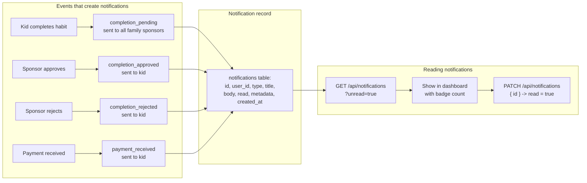

# Notification System

## How Notifications Flow

## Notification types

| Type | Triggered by | Sent to | Contains |
|------|-------------|---------|----------|
| `completion_pending` | Kid completes habit | All family sponsors | Kid name, habit name |
| `completion_approved` | Sponsor approves | Kid | Habit name, sat reward |
| `completion_rejected` | Sponsor rejects | Kid | Habit name, rejection reason |
| `payment_received` | Payment settles | Kid | Amount in sats |

## API

- **GET** `/api/notifications?unread=true` - Fetch notifications (max 50, newest first)
- **PATCH** `/api/notifications` `{ id }` - Mark a notification as read

## Related flows

- [Habit Completion](./habit-completion.md) - triggers `completion_pending`
- [Payment Cascade](./payment-cascade.md) - triggers `completion_approved` and `payment_received`
