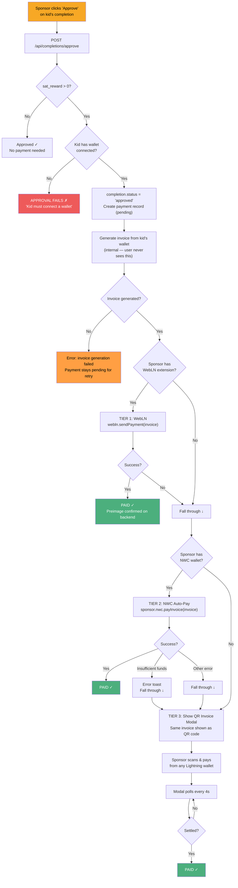
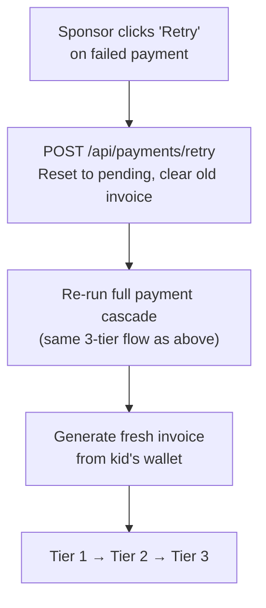

# Payment Cascade (Sponsor Approves Habit)

This is the core flow. When a sponsor approves a kid's habit completion, a multi-tier payment cascade sends sats to the kid's Lightning wallet.

## What happens step by step

## The three tiers

| Tier | Method | What happens | User sees |
|------|--------|-------------|-----------|
| 1 | **WebLN** | Browser extension pays the invoice automatically | Nothing — just a "Paid!" toast |
| 2 | **NWC Auto-Pay** | Server uses sponsor's stored NWC wallet to pay | Nothing — just a "Paid!" toast |
| 3 | **QR Invoice** | Invoice shown as QR code, sponsor pays from any wallet app | QR code modal |

- The invoice is generated **once** from the kid's wallet and reused across all 3 tiers
- In Tiers 1 and 2, the user never sees the invoice — it's an internal protocol step
- In Tier 3, the same invoice is displayed as a scannable QR code

## Sponsor wallet is optional

| Sponsor setup | What happens |
|--------------|-------------|
| No wallet, no extension | Tier 3 only: QR code shown |
| NWC wallet connected | Tier 2 first (auto-pay), Tier 3 if it fails |
| WebLN extension installed | Tier 1 first (instant), then Tier 2, then Tier 3 |
| Both NWC + WebLN | Tries all three in order |

The only **required** wallet is the kid's — it generates the invoice. If the kid has no wallet, the approval fails.

## Payment retry

Failed payments can be retried anytime from the Payments tab. Retry resets the payment and re-runs the full cascade (generate new invoice → Tier 1 → 2 → 3).

## Error handling

| Error | When | User sees |
|-------|------|-----------|
| Kid has no wallet | During approval | Approval fails: "Kid must connect a wallet" |
| Invoice generation failed | NWC error | "Error generating invoice" — retry later |
| WebLN rejected | User declines in extension | "Declined" toast, falls to next tier |
| Insufficient funds | NWC auto-pay | "Insufficient funds" toast, falls to QR |
| NWC error | Auto-pay fails | Silent fallthrough to QR |
| Polling issues | QR modal | "Connection issues" warning, keeps retrying |

## Related flows

- [Invoice Modal](./invoice-modal.md) — QR code fallback details
- [Payment Retry](./payment-retry.md) — retry flow details
- [Wallet Connection](./wallet-connection.md) — how wallets get connected
