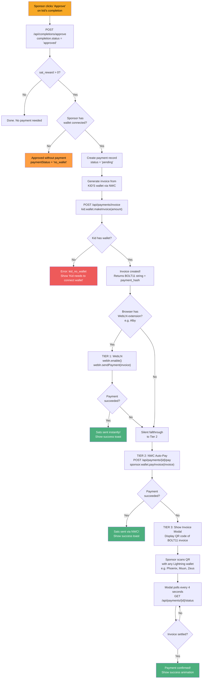

# Payment Cascade (Sponsor Approves Habit)

This is the core flow. When a sponsor approves a kid's habit completion, a multi-tier payment cascade tries to send sats to the kid's Lightning wallet.

## What happens step by step

## Why three tiers?

| Tier | Method | How it works | When it's used |
|------|--------|-------------|----------------|
| 1 | **WebLN** | Browser extension (like Alby) pays instantly from sponsor's browser | Sponsor has Alby or similar installed |
| 2 | **NWC Auto-Pay** | Server uses sponsor's stored NWC connection to pay | Sponsor connected wallet but no browser extension |
| 3 | **QR Invoice** | Shows a QR code; sponsor scans with any Lightning wallet app | Fallback when automated methods fail |

## Related flows

- [Lightning Basics](./lightning-basics.md) - understand what invoices and NWC are
- [Invoice Modal](./invoice-modal.md) - details on the QR code fallback
- [Payment Retry](./payment-retry.md) - what happens when a payment fails
- [Wallet Connection](./wallet-connection.md) - how wallets get connected in the first place
