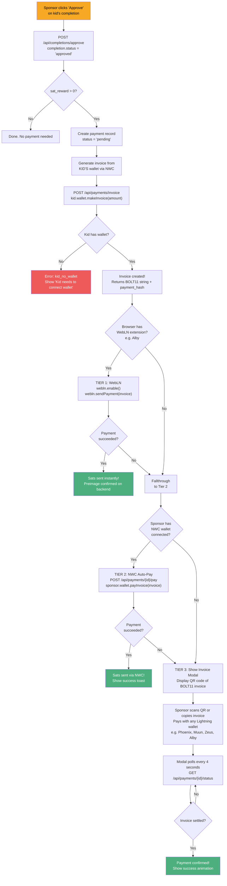

# Payment Cascade (Sponsor Approves Habit)

This is the core flow. When a sponsor approves a kid's habit completion, a multi-tier payment cascade tries to send sats to the kid's Lightning wallet.

## What happens step by step

## Why three tiers?

| Tier | Method | How it works | When it's used |
|------|--------|-------------|----------------|
| 1 | **WebLN** | Browser extension (like Alby) pays instantly from sponsor's browser. Optional — not required | Sponsor has a WebLN-compatible extension installed |
| 2 | **NWC Auto-Pay** | Server uses sponsor's stored NWC connection to pay automatically | Sponsor connected a wallet via NWC URL |
| 3 | **QR Invoice** | Shows a QR code; sponsor pays with any Lightning wallet app | Always available as fallback — no wallet connection required on the sponsor side |

## Important: Sponsor wallet is optional

The sponsor does **not** need to connect a wallet to approve habits or pay. Here's what each scenario looks like:

| Sponsor setup | What happens on approval |
|--------------|------------------------|
| No wallet, no extension | Tier 3 only: QR code shown, sponsor pays from any external wallet |
| NWC wallet connected, no extension | Tier 2 first (auto-pay), falls back to Tier 3 if it fails |
| WebLN extension installed | Tier 1 first (instant), falls through to Tier 2, then Tier 3 |
| Both NWC + WebLN | Tries all three tiers in order |

The only wallet that's **required** is the kid's wallet — it generates the invoice that the sponsor pays.

## Related flows

- [Lightning Basics](./lightning-basics.md) - understand what invoices and NWC are
- [Invoice Modal](./invoice-modal.md) - details on the QR code fallback
- [Payment Retry](./payment-retry.md) - what happens when a payment fails
- [Wallet Connection](./wallet-connection.md) - how wallets get connected in the first place
