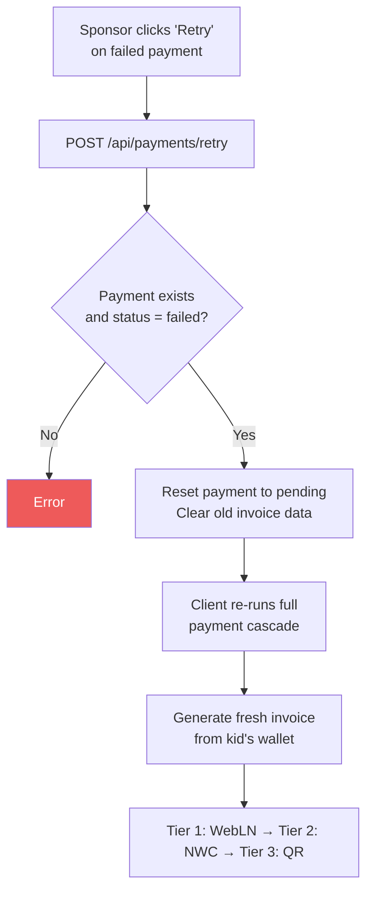

# Payment Retry

When a payment fails (NWC error, insufficient funds, etc.), sponsors can retry anytime from the Payments tab.

## Retry Flow

## How it works

1. Sponsor sees a failed payment in the Payments tab with a "Retry" button
2. Clicking retry resets the payment to `pending` and clears stale invoice data
3. The client runs the exact same 3-tier cascade as the original approval
4. A fresh invoice is generated from the kid's wallet (old one may have expired)
5. The cascade tries WebLN, then NWC auto-pay, then shows QR modal

## No time limit

Sponsors can retry failed payments at any time. There's no expiration window.

## Related flows

- [Payment Cascade](./payment-cascade.md) — the 3-tier cascade that retry re-runs
- [Invoice Modal](./invoice-modal.md) — the QR fallback shown in Tier 3
