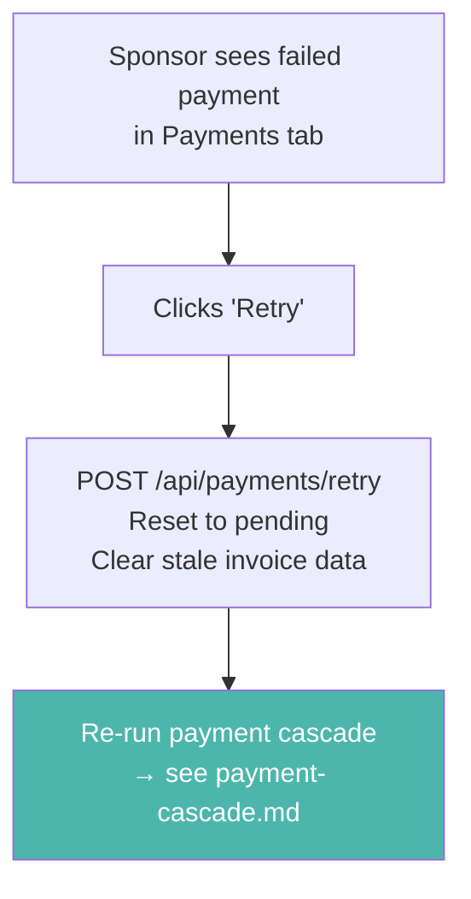

# Payment Retry

Failed or expired payments can be retried anytime from the Payments tab. There is no time limit.

## When does a payment need retry?

| Cause | What happened |
|-------|--------------|
| Invoice expired | QR code wasn't scanned in time |
| NWC error | Wallet was unreachable during auto-pay |
| Insufficient funds | Sponsor didn't have enough sats at the time |
| Invoice generation failed | Kid's wallet was offline |

## Retry flow

## How it works

1. Sponsor goes to the **Payments tab** and sees a failed payment with a **Retry** button
2. Clicking retry calls `POST /api/payments/retry` which resets the payment to `pending` and clears old invoice data
3. The client re-runs the exact same [payment cascade](./payment-cascade.md) — a fresh invoice is generated from the kid's wallet and the 3-tier flow (WebLN → NWC → QR) runs again

## Related flows

- [Payment Cascade](./payment-cascade.md) — the 3-tier flow that retry re-runs
- [Invoice Modal](./invoice-modal.md) — the QR fallback shown in Tier 3
