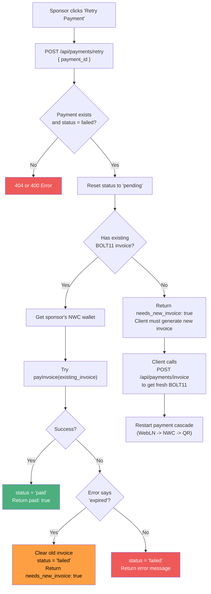

# Payment Retry

When a payment fails (NWC error, timeout, etc.), sponsors can retry from the payments tab.

## Retry Flow

## Why do invoices expire?

Lightning invoices have a built-in expiry (usually 1 hour). If the sponsor doesn't pay in time, the invoice becomes invalid and a new one must be generated from the kid's wallet.

## Related flows

- [Payment Cascade](./payment-cascade.md) - the initial payment attempt
- [Invoice Modal](./invoice-modal.md) - the QR fallback that might time out
