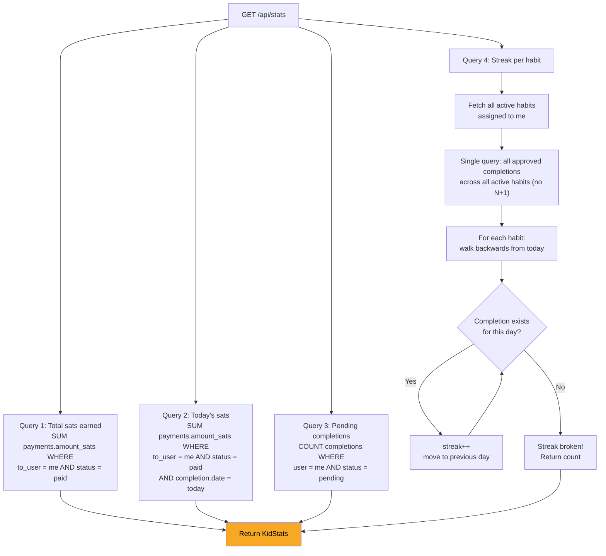

# Stats & Streaks

## How Stats Are Calculated



## todaySats

Today's sats counts only **actually paid** payments, not just approved completions. This prevents showing sats the kid hasn't received yet (e.g., when the payment is still pending or failed).

The query joins `payments` with `completions` and filters:
- `payments.to_user_id = me`
- `payments.status = 'paid'`
- `completions.date = today`

## Streak calculation

Streaks count consecutive days of approved completions, starting from today and walking backwards:

1. Start at today's date
2. Check if there's an approved completion for this date
3. If yes: increment streak, move to previous day, repeat
4. If no and streak is 0: try yesterday (allows "not yet completed today" without breaking the streak)
5. If no and streak > 0: streak is broken, return the count

A streak of 0 means the kid hasn't completed the habit today or yesterday. The `bestStreak` field returns the highest streak across all active habits.

## Response shape

```json
{
  "totalSats": 1250,
  "todaySats": 50,
  "bestStreak": 7,
  "pendingCount": 2,
  "streaks": [
    { "habit_id": "...", "habit_name": "Make bed", "current_streak": 7 },
    { "habit_id": "...", "habit_name": "Read 20min", "current_streak": 3 }
  ]
}
```

## Related flows

- [Habit Completion](./habit-completion.md) - completions feed into streaks
- [Payment Cascade](./payment-cascade.md) - payments feed into total sats and today's sats
