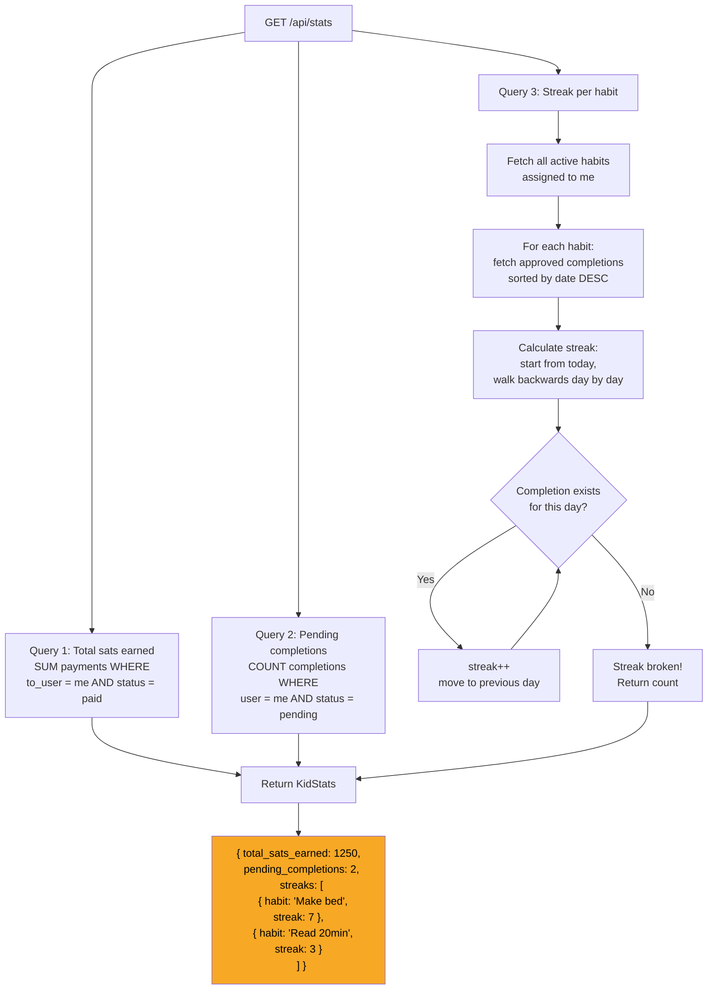

# Stats & Streaks

## How Stats Are Calculated



## Streak calculation

Streaks count consecutive days of approved completions, starting from today and walking backwards:

1. Start at today's date
2. Check if there's an approved completion for this date
3. If yes: increment streak, move to previous day, repeat
4. If no: streak is broken, return the count

A streak of 0 means the kid didn't complete the habit today. A streak of 7 means 7 consecutive days including today.

## Response shape

```json
{
  "total_sats_earned": 1250,
  "pending_completions": 2,
  "streaks": [
    { "habit_id": "...", "habit_name": "Make bed", "current_streak": 7 },
    { "habit_id": "...", "habit_name": "Read 20min", "current_streak": 3 }
  ]
}
```

## Related flows

- [Habit Completion](./habit-completion.md) - completions feed into streaks
- [Payment Cascade](./payment-cascade.md) - payments feed into total sats
