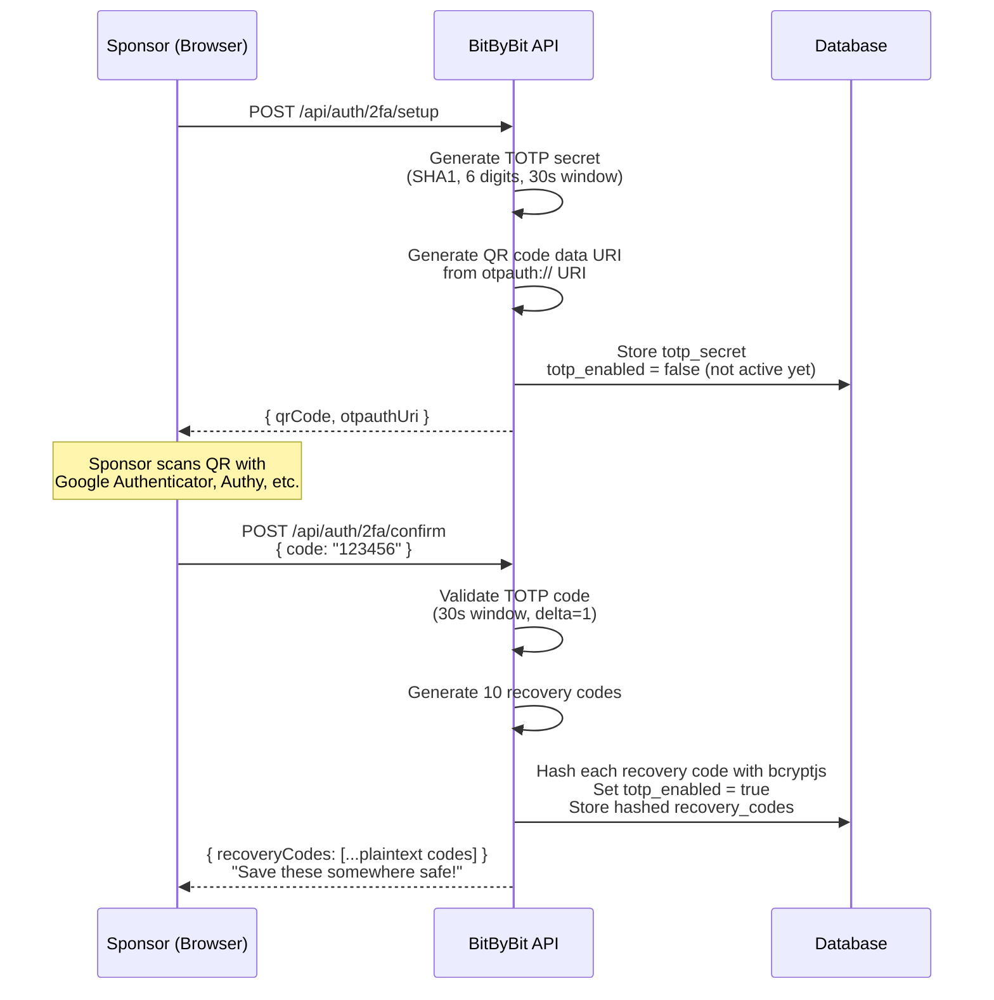
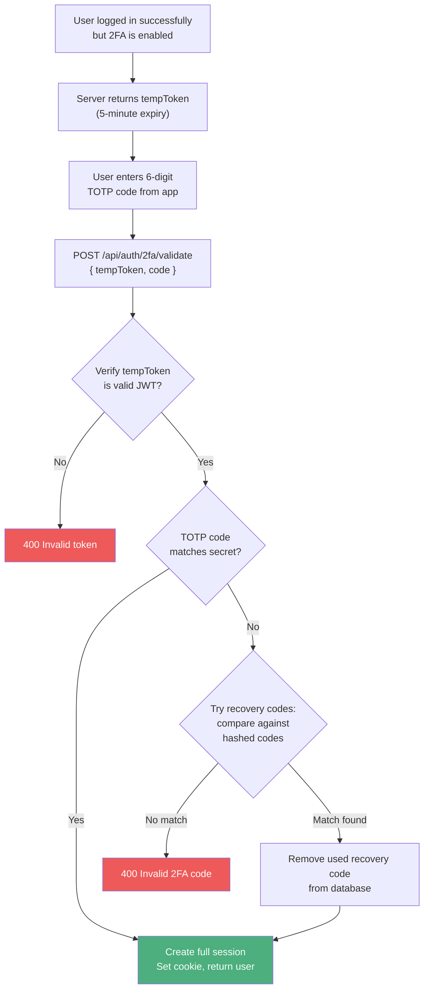

# Two-Factor Authentication (2FA)

## Setup (Sponsor enables 2FA)

## Validation (Login with 2FA)

## How TOTP works

1. A shared secret is generated and stored (encrypted) on the server
2. The user adds this secret to their authenticator app via QR code
3. Both server and app use the same algorithm: `HMAC-SHA1(secret, floor(time/30))`
4. This produces a new 6-digit code every 30 seconds
5. The server accepts the current code and the previous one (delta=1) to account for clock drift

## Recovery codes

- 10 codes generated during setup
- Each code is hashed with bcryptjs before storing
- One-time use: once a recovery code is used, it's permanently removed
- Shown to the user only once during setup (never retrievable again)

## Related flows

- [Registration & Login](./auth.md) - the login flow that triggers 2FA
