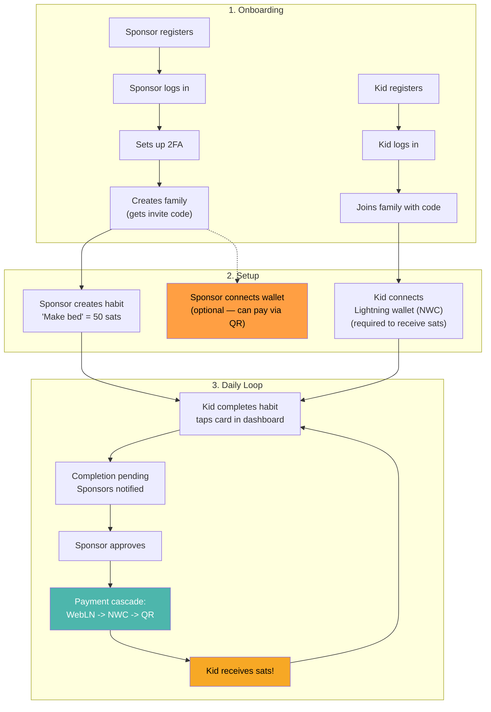

# Complete User Journey (End-to-End)

## Overview

## Step-by-step with links

### Phase 1: Onboarding
1. **Sponsor registers** an account ([Registration & Login](./auth.md))
2. **Sponsor logs in** and is prompted to set up 2FA ([Two-Factor Auth](./two-factor-auth.md))
3. **Sponsor creates a family** and gets a 6-character invite code ([Family Management](./family-management.md))
4. **Kid registers** and logs in
5. **Kid joins family** using the invite code

### Phase 2: Setup
6. **Kid connects Lightning wallet** via NWC URL or browser extension ([Wallet Connection](./wallet-connection.md)) -- **required** to receive payments
7. **Sponsor connects wallet** (optional) via NWC URL or browser extension -- enables auto-pay; without it, sponsor pays via QR scan
8. **Sponsor creates habits** with sat rewards ([Habit Lifecycle](./habit-lifecycle.md))

### Phase 3: Daily Loop
9. **Kid completes habit** by tapping the card ([Habit Completion](./habit-completion.md))
10. **Sponsors get notified** of pending completion ([Notifications](./notifications.md))
11. **Sponsor approves** the completion
12. **Payment cascade fires**: WebLN, NWC auto-pay, or QR invoice ([Payment Cascade](./payment-cascade.md))
13. **Kid receives sats** in their Lightning wallet
14. **Streaks grow** with consecutive daily completions ([Stats & Streaks](./stats-and-streaks.md))
15. Repeat from step 9!

### What if something goes wrong?

| Scenario | What happens |
|----------|-------------|
| Kid has no wallet | Invoice can't be generated — sponsor sees "Kid needs to connect wallet" |
| Sponsor has no wallet | Tiers 1-2 are skipped, QR invoice shown directly |
| Insufficient funds | Error toast shown, QR invoice shown as fallback |
| NWC service down | Auto-pay fails silently, QR invoice shown as fallback |
| Invoice expires | Sponsor can retry from payments tab — new invoice is generated |
| Polling fails | Modal shows connection warning, keeps retrying |
