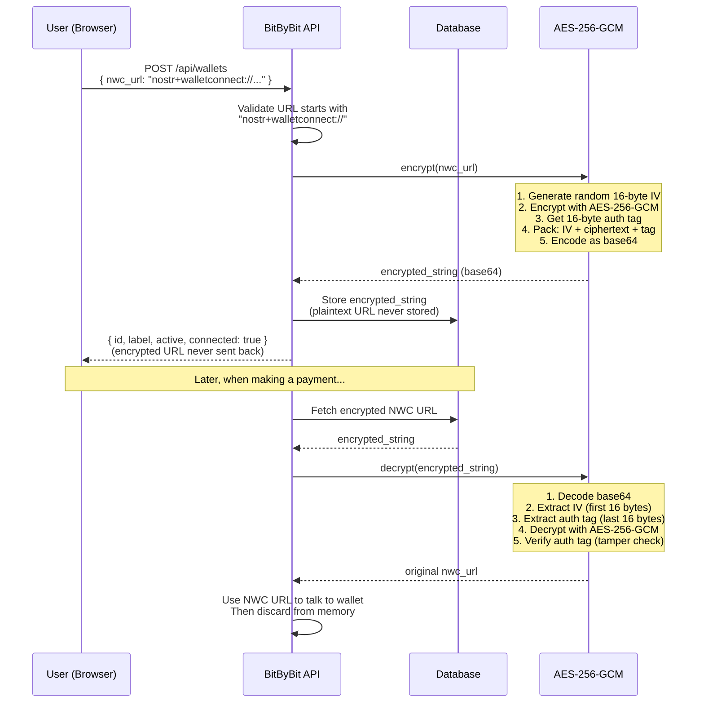

# Wallet Connection & Encryption

How a user connects their Lightning wallet and how we protect the connection string.

## Connection Flow

## Why AES-256-GCM?

- **AES-256**: Military-grade encryption standard (NIST approved)
- **GCM mode**: Provides both encryption AND authenticity verification
- **Random IV**: Each encryption uses a unique initialization vector (no patterns)
- **Auth tag**: If anyone tampers with the encrypted data, decryption fails

## What's protected

| Data | Storage | Sent to browser? |
|------|---------|-----------------|
| NWC URL (plaintext) | Never stored | Never |
| Encrypted NWC URL | In database | Never |
| Wallet label | In database | Yes |
| Wallet active status | In database | Yes |
| Encryption key | Environment variable | Never |

## Related flows

- [Payment Cascade](./payment-cascade.md) - when decryption happens during payments
